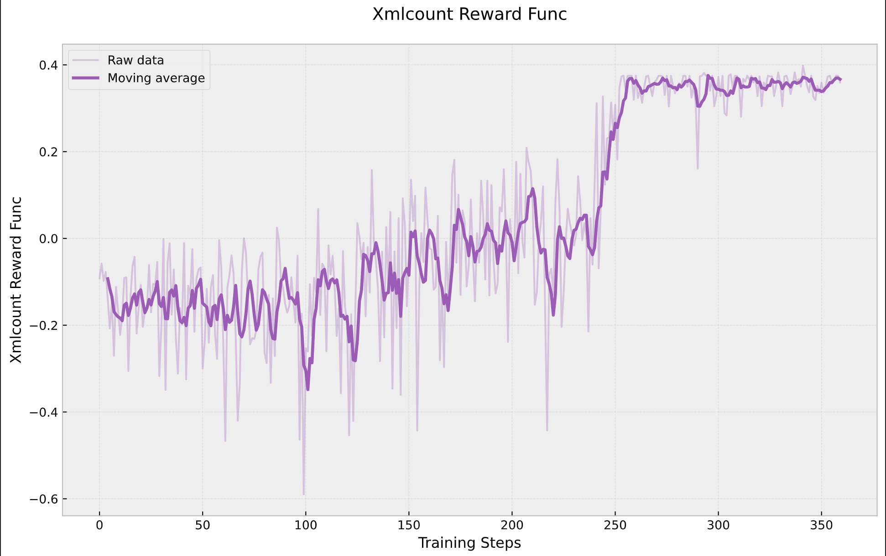
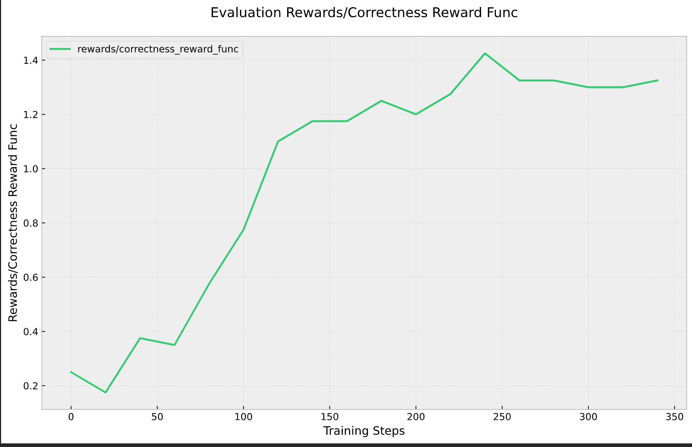
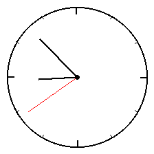
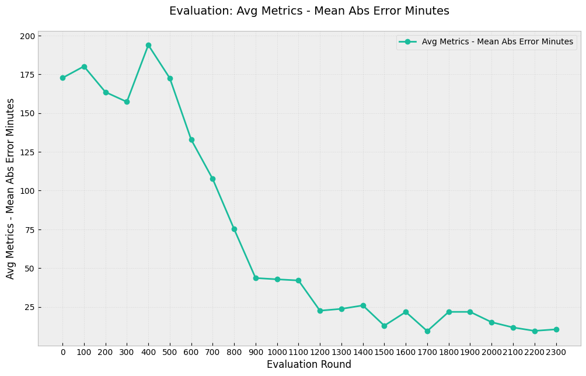
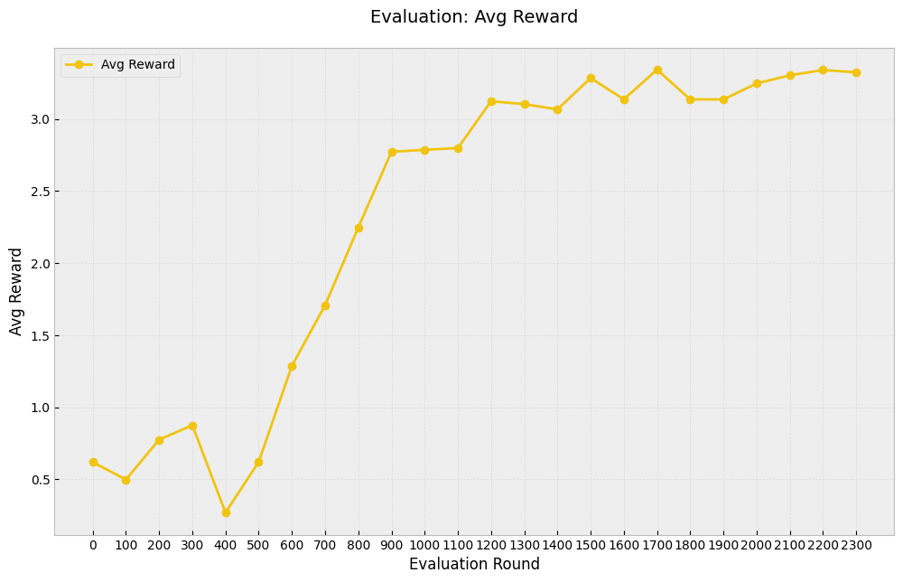
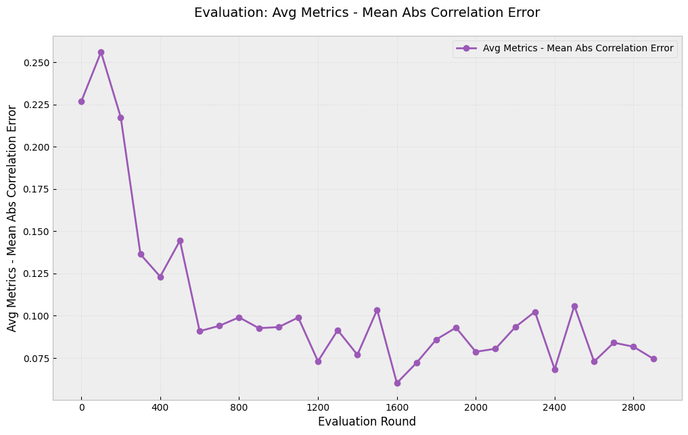

# DeepSeek R1 Implementation

## Motivation
I wanted to recreate DeepSeek R1's  results at a smaller scale, focusing on understanding the core mechanics by implementing everything from scratch. So this is a repo that trains Qwen1.5B on the [grade school math dataset](https://github.com/openai/grade-school-math).

This implementation heavily borrows from [Will Brown's  work](https://gist.github.com/willccbb/4676755236bb08cab5f4e54a0475d6fb) ([@willccbb](https://x.com/willccbb)), but restructures the code into a format optimized for learning and experimentation.

The key difference in my implementation is computing the GRPO loss function directly rather than using external RL libraries, and reformatting into a multi script repo.

I hope this might help other people understand things better, and maybe provide an easier way to try out smaller scale ideas etc. 

## Installation
```
pip install -r requirements.txt
```

Required environment variables:
```
export HUGGINGFACE_TOKEN="your-token-here"
huggingface-cli login
```

## Implementation Details

The system consists of several key modules:

### main.py
Contains the core training loop implementing GRPO (Generalized Reward-Powered Optimization). Handles model training, evaluation, and metric tracking. 

### llms.py 
Manages model loading and configuration, currently supporting LLaMA + Qwen models through Hugging Face's transformers library. Designed to be easily extensible to other model architectures.

### rldatasets.py
Handles dataset loading and preprocessing, currently focused on GSM8K math problems. Implements custom data loaders for both training and evaluation.

### evaluator.py
Contains evaluation metrics and reward functions, closely following DeepSeek's original implementation.

## Results
Training was conducted on a single H100 GPU. After ~400 training steps:



And results on the validation set - this shows a clearer sign of learning: 


## Clock Reading Task: Geometric Reasoning with VLMs

To further explore the capabilities of this RL approach, particularly for tasks requiring spatial and geometric reasoning, I implemented a clock reading task using a Vision-Language Model (Qwen-VL).

### The Task
The core idea is to train the VLM to accurately read the time displayed on an analog clock face.
1.  **Image Generation:** Synthetic analog clock images are generated, each displaying a specific, randomly chosen time (hour, minute, second).
    ```python
    # Example of clock generation logic (simplified)
    # clock_image = generate_clock_image(hour, minute, second)
    ```
    Here's an example of a generated clock face:
    

2.  **Model Input:** The VLM receives the generated clock image and a prompt asking for the time displayed.
3.  **Model Output:** The model is expected to output the time in a structured format (e.g., HH:MM:SS) within designated tags (e.g., `<answer>HH:MM:SS</answer>`).
4.  **Reward Calculation:** The reward signal is directly tied to the accuracy of the predicted time. The absolute difference (in seconds) between the model's predicted time and the ground truth time is calculated. This difference is then used to compute a reward, where smaller time differences yield higher rewards. This incentivizes the model to learn the geometric relationships between the clock hands (hour, minute, second) and their corresponding time values.

### Results on Clock Reading
The GRPO training process proved effective for this task as well. The model significantly improved its ability to read the analog clocks over several evaluation rounds.

-   **Mean Absolute Error:** The plot below shows the average error (in minutes) between the predicted time and the actual time. Initially, the model's predictions were off by nearly 3 hours (around 180 minutes), but through training, this error decreased dramatically to approximately 10 minutes.
    

-   **Average Reward:** Correspondingly, the average reward per evaluation example increased, reflecting the model's improved accuracy.
    

These results demonstrate the potential of using reinforcement learning techniques like GRPO to enhance the geometric and spatial reasoning capabilities of VLMs on specialized tasks.

### Running the Clock Experiment

To replicate or experiment with the clock reading task:

1.  **Dataset:** The clock images are generated on-the-fly during training and evaluation. The dataset configuration within `rldatasets.py` (`ClockDataset`) handles the generation of random times and rendering the corresponding clock images using the `ClockImageGenerator` class found in `clock_image_generator.py`. No separate dataset download or preparation is required.

2.  **Configuration:** Modify the `main.py` script or use command-line arguments to set the following:
    *   `--model_path`: Specify the path to the Qwen-VL model (e.g., `Qwen/Qwen-VL-Chat`).
    *   `--dataset_name`: Set this to `"clock"` to use the `ClockDataset`.
    *   `--output_dir`: Define a directory to save logs, plots, and model checkpoints.
    *   Adjust other hyperparameters as needed (e.g., learning rate, batch size, evaluation frequency).

3.  **Run Training:** Execute the main script:
    ```bash
    python main.py \
        --model_path Qwen/Qwen-VL-Chat \
        --dataset_name clock \
        --output_dir ./clock_experiment_output \
        --num_train_epochs 5 \
        --eval_steps 50
        # Add other relevant arguments
    ```

4.  **Monitor Results:** Training logs (`train_logs.json`) and evaluation metrics/plots (`eval_logs/`) will be saved in the specified `output_dir`. The `plotter.py` script can be used to visualize the results (`python plotter.py --output_dir ./clock_experiment_output`).

## Correlation Task: Learning Numerical Relationships

Building on the idea of teaching the model visual-spatial reasoning, another experiment involved training the model to estimate the Pearson correlation coefficient directly from a scatter plot image.

### The Task
1.  **Image Generation:** Generate scatter plots with varying degrees of linear correlation (positive and negative).
    An example input plot might look like this, where the underlying correlation is 0.7:
    
2.  **Model Input:** The VLM receives the scatter plot image and a prompt asking for the correlation coefficient.
3.  **Model Output:** The model is expected to output the predicted correlation value (a float between -1.0 and 1.0).
4.  **Reward Calculation:** The reward is based on the absolute difference between the model's predicted correlation and the ground truth correlation used to generate the plot. Smaller differences result in higher rewards.

### Results on Correlation Estimation
Training showed promising results, with the model learning to better estimate the correlation from the visual data.
- **Mean Absolute Error:** The plot below illustrates the reduction in the average absolute error of the model's correlation predictions during training. The error decreased from approximately 0.225 initially down to around 0.07.
    

This demonstrates the model's ability to learn numerical relationships presented visually.

### Running the Correlation Experiment

1.  **Dataset:** Similar to the clock task, correlation plots are generated on-the-fly by `correlation_generator.py` as configured in `rldatasets.py` (`CorrelationDataset`).
2.  **Configuration:** In `main.py` or via command-line:
    *   Set `--model_path` to the VLM (e.g., `Qwen/Qwen-VL-Chat`).
    *   Set `--dataset_name` to `"correlation"`.
    *   Set `--output_dir`.
3.  **Run Training:**
    ```bash
    python main.py \\
        --model_path Qwen/Qwen-VL-Chat \\
        --dataset_name correlation \\
        --output_dir ./correlation_experiment_output \\
        --num_train_epochs 5 \\
        --eval_steps 50
        # Add other relevant arguments
    ```
4.  **Monitor Results:** Use `plotter.py` on the `output_dir`.

## Next Steps

Future work aims to explore more complex interactions and reasoning:

1.  **Tool Use Integration:** Allow the model to utilize tools based on its predictions. For instance, after predicting a time from a clock or a correlation from a plot, the model could use a tool to generate a visual representation (a new clock face or plot) based on its prediction. It could then compare this generated image to the original input and refine its initial prediction based on the visual feedback.
2.  **Generative Multi-Turn Visual Environments:** Explore generating entire scenes or sequences of visual puzzles. This could involve creating scenarios where the model needs to solve multiple related visual tasks across several turns, potentially using tools to manipulate or query parts of the visual environment. The goal is to develop verifiable, programmatically generated environments for more complex multi-turn visual reasoning and tool use.

## Citation
If you find this repository useful, please consider citing:
```bibtex
@misc{hogan2024deepseek_rl_extended,
  author = {Hogan, Brendan},
  title = {DeepSeekRL-Extended},
  year = {2024},
  publisher = {GitHub},
  journal = {GitHub repository},
  url = {https://github.com/brendanhogan/DeepSeekRL-Extended}
}
```


